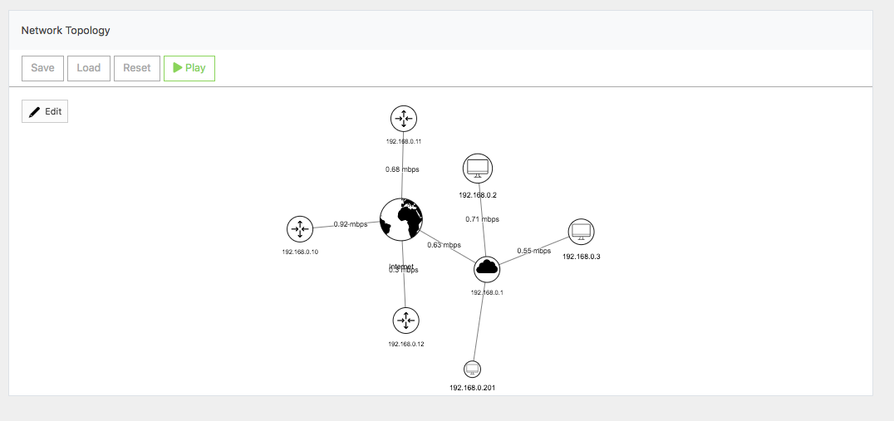
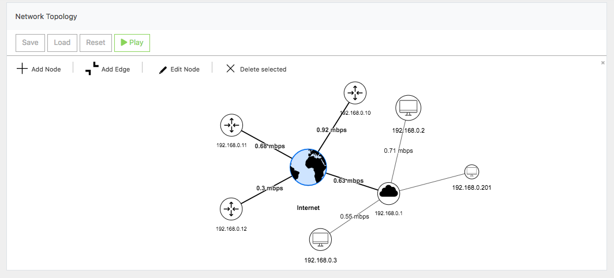

# Network-Topology-Visualisation-with-vis.js
This is a exampe of visualisation a network topology with the vis.js framwork.
for using this example just clone the repo switch into the src folder and open the
index.html file. 
 

# Credits
The images are from the https://thenounproject.com/. The authors are the following: 
<text x="0" y="143" fill="#000000" font-size="5px" font-weight="bold" font-family="'Helvetica Neue', Helvetica, Arial-Unicode, Arial, Sans-serif">Created by SBTS</text><text x="0" y="148" fill="#000000" font-size="5px" font-weight="bold" font-family="'Helvetica Neue', Helvetica, Arial-Unicode, Arial, Sans-serif"> from the Noun Project</text> 
<text x="0" y="115" fill="#000000" font-size="5px" font-weight="bold" font-family="'Helvetica Neue', Helvetica, Arial-Unicode, Arial, Sans-serif">Created by Thengakola</text><text x="0" y="120" fill="#000000" font-size="5px" font-weight="bold" font-family="'Helvetica Neue', Helvetica, Arial-Unicode, Arial, Sans-serif">from the Noun Project</text> 
<text x="0" y="115" fill="#000000" font-size="5px" font-weight="bold" font-family="'Helvetica Neue', Helvetica, Arial-Unicode, Arial, Sans-serif">Created by Michael Zenaty</text><text x="0" y="120" fill="#000000" font-size="5px" font-weight="bold" font-family="'Helvetica Neue', Helvetica, Arial-Unicode, Arial, Sans-serif">from the Noun Project</text> 
<text x="0" y="115" fill="#000000" font-size="5px" font-weight="bold" font-family="'Helvetica Neue', Helvetica, Arial-Unicode, Arial, Sans-serif">Created by b farias</text><text x="0" y="120" fill="#000000" font-size="5px" font-weight="bold" font-family="'Helvetica Neue', Helvetica, Arial-Unicode, Arial, Sans-serif">from the Noun Project</text> 
<text x="0" y="115" fill="#000000" font-size="5px" font-weight="bold" font-family="'Helvetica Neue', Helvetica, Arial-Unicode, Arial, Sans-serif">Created by Leonardo Schneider</text><text x="0" y="120" fill="#000000" font-size="5px" font-weight="bold" font-family="'Helvetica Neue', Helvetica, Arial-Unicode, Arial, Sans-serif">from the Noun Project</text> 
<text x="0" y="115" fill="#000000" font-size="5px" font-weight="bold" font-family="'Helvetica Neue', Helvetica, Arial-Unicode, Arial, Sans-serif">Created by Mahmure Alp</text><text x="0" y="120" fill="#000000" font-size="5px" font-weight="bold" font-family="'Helvetica Neue', Helvetica, Arial-Unicode, Arial, Sans-serif">from the Noun Project</text> 
